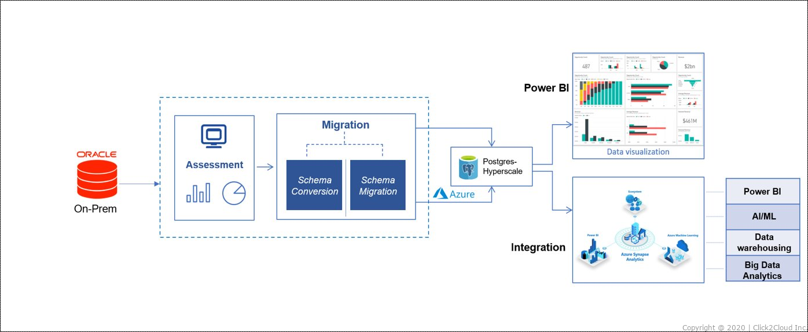

# Azure DMS: Oracle to Azure PostgreSQL

The Azure Database Migration Service is a tool that serves as a way to migrate, guide, and automate your current database migration to Azure. Effortlessly migrate data, schemas, and objects from various sources to the cloud.

## Azure DMS provides the following features:
* Supports Microsoft SQL Server, MySQL, PostgreSQL, MongoDB, and Oracle migration to Azure from on-premises and other clouds.
* Migration moves data, schema, and objects to Azure.
* Highly expansive migration service provides stable outcomes with almost no downtime.
* Database Migration Service works with PowerShell commandlets to automatically migrate a list of databases.
* Comprehensive security and compliance, built in.

## **Scenario**

<kbd>
  
</kbd>

### **Scenario Details:**  
We created an on-prem Oracle database through an Azure Windows 2019 Server VM with an Oracle image (12.2.0.1.0 Enterprise Edition) installed. We then assess what tables and objects we want to migrate to the created Azure PostgreSQL Database. Once this is determined we migrate the schema from the Oracle Database to the Azure PostgreSQL Databbase. After this we set up Azure DMS by connecting both databases so continuous sync can happen between our tables. Once completed, the PostgreSQL Database can be used for applications and analytics.

### **Scenario Setup:**

* **Source VM:** Windows Server 2019 with Oracle Image installed (12.2.0.1.0 Enterprise Edition)
* **Oracle Database:** Non-Container Database, version 12.2.0.1.0 Enterprise Edition
* **PostgreSQL Database:** Azure PostgreSQL-Single Server, PostgreSQL version 10
* **Oracle Database Contents:** Contains STORE table with 1000 generated rows
* **PostgreSQL Database Contents:** Contains STORE(empty pre-migration), SALES_TRANSACTION(100 million rows), and PRODUCTS(1000+ rows) tables
* **Duration of Demo:** Approximately 30 minutes

## 1. Set up prerequisites
* Link to Prerequisites tutorial: [Prerequisites](https://github.com/Click2Cloud/azure-oracle-migration/blob/master/Prerequisites/PREREQUISITES.md)
* Before provisioning the Azure DMS tool, we will have to set up our databases correctly
* These steps are required in order for our Source and Target Databases to connect to Azure DMS

## 2. Connect Oracle Database and PostgreSQL Database to Azure DMS
* Link to written DMS tutorial (with pictures): [DMS Demo Tutorial](https://github.com/Click2Cloud/azure-oracle-migration/blob/master/Tutorials/DMStutorial.md)
* Link to DMS tutorial video (can be downloaded): [DMS Demo Tutorial Video](https://github.com/Click2Cloud/azure-oracle-migration/blob/master/Videos/azuredmsdemo.mp4)
* Once prerequisites are done we can move on to setting up Azure DMS

