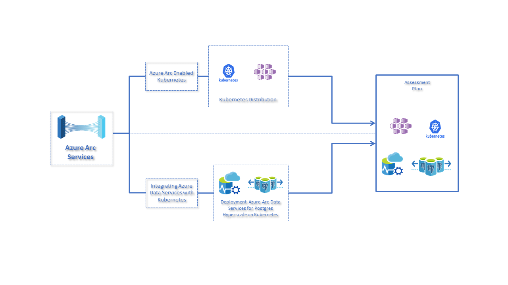
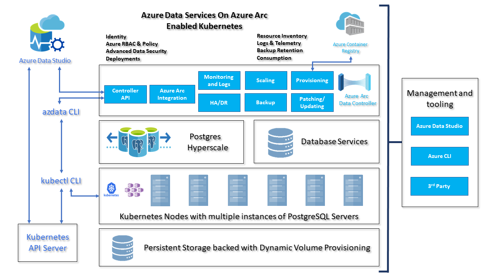

# Azure Arc enabled data services 

## Prerequisite

Note: You need at least one Standard_D8s_v3 (8 vCPU's 32 RAM GiB) and premium disks supported worker nodes to achieve the scenario.

## Scenario

## Deploy Kubernetes on Azure

User can create Kubernetes cluster using Terraform to [deploy the Azure Kubernetes Service(AKS) Cluster using Terraform](kubernetes-templates/azure/terraform/README.md)

User can create Kubernetes cluster using ARM template to [deploy the Azure Kubernetes Service(AKS) Cluster using ARM template](kubernetes-templates/azure/arm-template/README.md)

## Deploy on Existing Kubernetes Environment

If you have a pre-existing Kubernetes cluster, then you can begin by building a tools container and deploy to your Kubernetes cluster from there. If you are using Azure Kubernetes Service, your cluster's node VM should be at least Standard_D8s_v3 and use premium disks. If you are using another Kubernetes distribution or service you should ensure that you have a minimum node size of 8 GB, 4 cores and a total capacity of 32 GB available across all of your Kubernetes nodes. For example, you could have 1 node at 32 GB, 4 cores, or you could have 2 nodes with 16GB and 4 cores each.

## Azure Data Controller and PostgreSQL Hyperscale installation with required tools.

1. [Installation of Client Tools](docs/001-install-client-tools.md) (azdata, kubectl, Azure CLI, Azure Data Studio (Insiders))
2. [Create Data Controller](docs/002-create-data-controller.md)
3. [Deployment of Postgres Hyperscale on Azure Arc](docs/003-create-pghsaa-instance.md)
4. [Load test data on Azure Database for PostgreSQL Hyperscale server group](docs/004-load-test-data.md)
5. [Scale out Azure Database for PostgreSQL Hyperscale server group](docs/005-scale-out-pghsaa.md)
6. [Uninstalling steps](docs/006-uninstall-azure-arc.md)

## Overall Architecture Diagram

