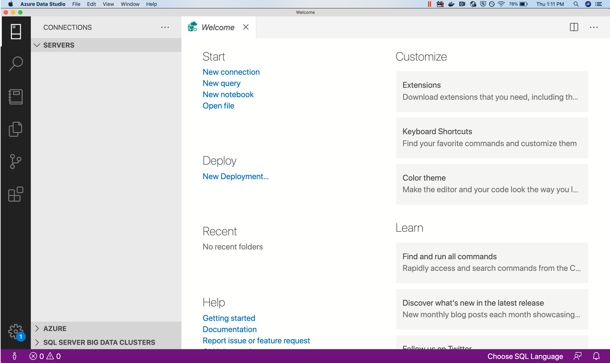
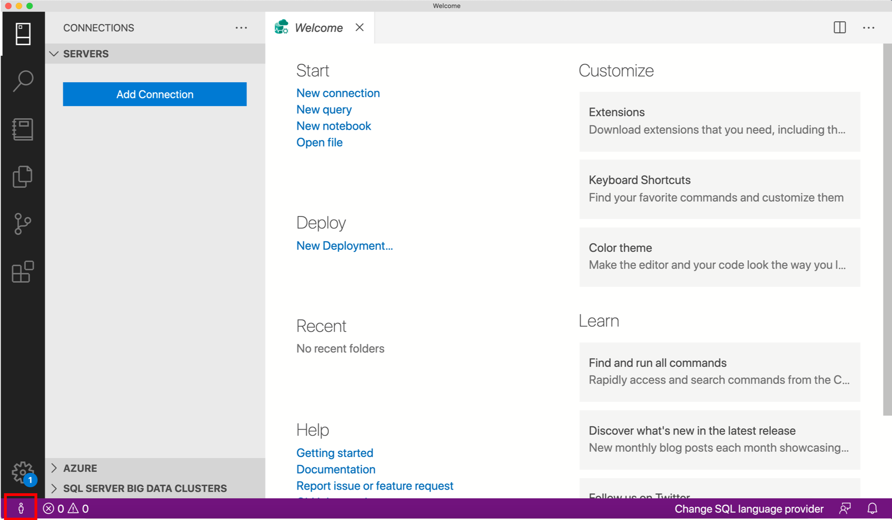
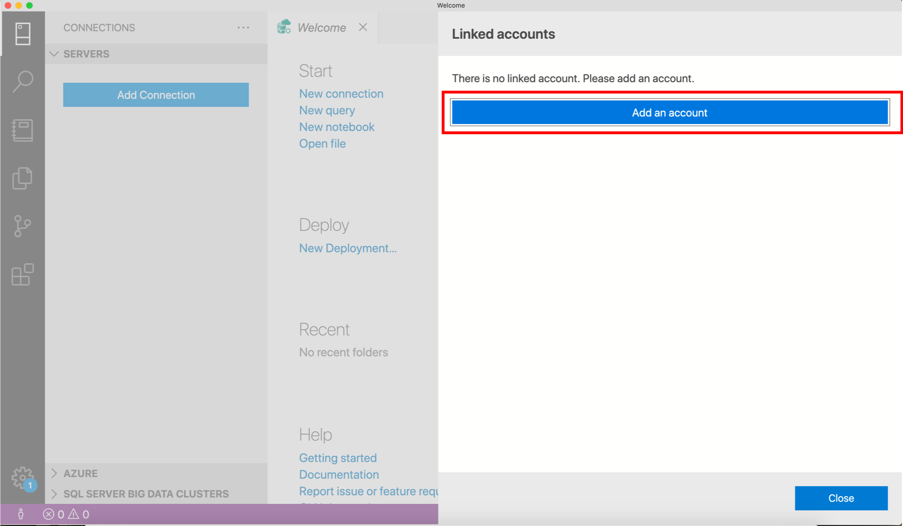
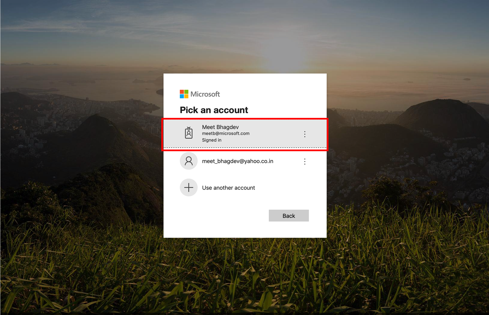
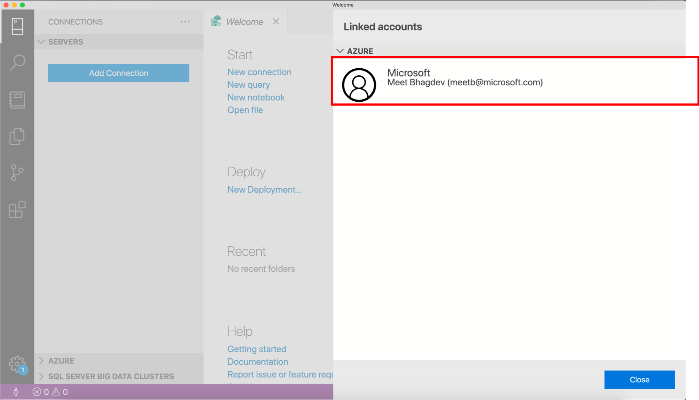

# Scenario: Install azdata, kubectl, Azure CLI, Azure Data Studio (Insiders), and the Arc extension for Azure Data Studio

This document walks you through the steps for installing azdata, kubectl and Azure CLI (az) on your client machine.

- azdata is a command-line tool to deploy, manage and use Azure Arc enabled data services.
- kubectl is a command-line tool for controlling Kubernetes clusters.  
- Azure CLI (az) is a command-line tool for managing Azure resources.
- Azure Data Studio is a GUI tool for DBAs, data engineers, data scientists, and data developers.

## Step 1: Install azdata

### Choose the steps for the Operating System you are using

Depending on your client OS, choose the instructions from below.

#### Windows

[Download msi and install](https://private-repo.microsoft.com/python/azure-arc-data/private-preview-jun-2020/msi/Azure%20Data%20CLI.msi)

### Ubuntu

#### xenial - Ubuntu 16.04

```terminal
apt-get update
apt-get install -y curl apt-transport-https unixodbc libkrb5-dev
curl -SL https://private-repo.microsoft.com/python/azure-arc-data/private-preview-jun-2020/ubuntu-xenial/azdata-cli_20.0.0-1~xenial_all.deb -o azdata-cli_20.0.0-1~xenial_all.deb
dpkg -i azdata-cli_20.0.0-1~xenial_all.deb
apt-get -f install
```

### CentoS

#### CentOS 7

```terminal
yum update
yum install curl epel-release -y
curl -SL https://private-repo.microsoft.com/python/azure-arc-data/private-preview-jun-2020/rpm/azdata-cli-20.0.0-1.el7.x86_64.rpm -o azdata-cli-20.0.0-1.el7.x86_64.rpm
yum localinstall azdata-cli-20.0.0-1.el7.x86_64.rpm -y
```

## Step 2: Install azdata extensions


> **Note:** all necessary extensions are included in the Windows MSI installer, thus the following `Install azdata extensions` step can be skipped if installing from MSI.

```terminal
azdata extension add --source https://private-repo.microsoft.com/python/azure-arc-data/private-preview-jun-2020/pypi-azdata-cli-extensions/azdata_cli_dc-0.0.1-py2.py3-none-any.whl --yes
azdata extension add --source https://private-repo.microsoft.com/python/azure-arc-data/private-preview-jun-2020/pypi-azdata-cli-extensions/azdata_cli_postgres-0.0.1-py2.py3-none-any.whl --yes
azdata extension add --source https://private-repo.microsoft.com/python/azure-arc-data/private-preview-jun-2020/pypi-azdata-cli-extensions/azdata_cli_sqlinstance-0.0.1-py2.py3-none-any.whl --yes
```

## Step 3: Verify azdata is installed


```terminal
azdata
azdata --version
```

> The version of azdata for the June release is 20.0.0.   Note that this is NOT the same as the 20.0.0 version of azdata that was released publicly for SQL Server big data clusters earlier in June.  We will converge on a single version of azdata, but for now please ensure you install azdata using the hyperlinks/instructions provided above.

## Step 4: Install kubectl

Once you have installed azdata, you need to install kubectl and make sure the current config points to your existing Kubernetes cluster.

Go here to install [kubectl](https://kubernetes.io/docs/tasks/tools/install-kubectl/).

> **NOTE:** If you are using OpenShift you will also want to have the oc CLI tool installed.

## Step 5: Install Azure CLI

Follow these steps to [install the Azure CLI](https://docs.microsoft.com/en-us/cli/azure/install-azure-cli?view=azure-cli-latest) on your client machine

Once installed, set the cloud environment and login

```terminal
az cloud set --name AzureCloud
az login
```

## Step 6: Verify your connection to Kubernetes

```terminal
kubectl version
kubectl get pods -A
```

## Step 7: Install Azure Data Studio and Arc extension and log into Azure

### Install Azure Data Studio (Insiders)

> **Note:** It's always a good idea to make sure you have the latest Azure Data Studio - Insiders build installed.  If you see a little blue dot on the cog in the lower left of Azure Data Studio, there is a new version of Azure Data Studio available for you.

[Install Azure Data Studio (Insiders)](https://azuredatastudio-update.azurewebsites.net/latest/win32-x64-user/insider)

### Download and Install the Azure Arc extension to Azure Data Studio

- Launch Azure Data Studio

- Download the [Azure Arc Extension VSIX](https://sqlopsextensions.blob.core.windows.net/extensions/arc/arc-0.1.0.vsix)
- File -> Install Extension from VSIX Package
- Select the VSIX you just downloaded and wait for it to finish
- Restart Azure Data Studio

### Login in with your Azure account

- Add Azure account

- Click on add an account

- Choose Azure account

- Verify that your Azure account was added successfully


## Next steps

Now [deploy the Azure Arc data controller](002-create-data-controller.md)
